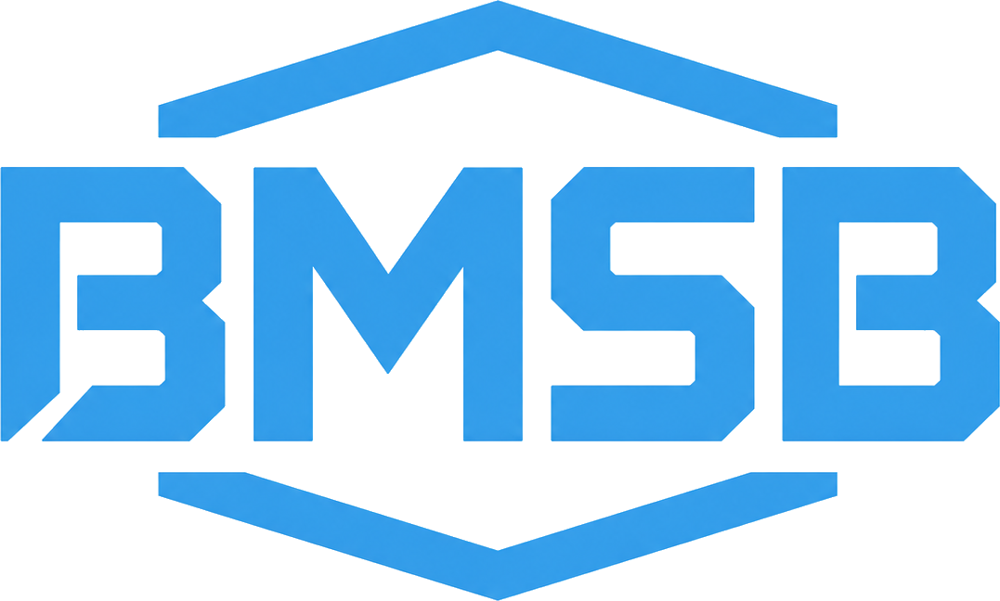

BMSB Bau- und Industrieservice GmbH
WIR BAUEN LÖSUNGEN. SCHAFFEN WERTE.
Eine moderne Unternehmenswebsite für Bau, Industrieservice und Instandhaltung.

 

  

Konzeption und Entwicklung: Muju

Ein Projekt von Muju

  

 <a href="#-über-das-projekt">Über das Projekt</a> · <a href="#-leistungen">Leistungen</a> · <a href="#-funktionen">Funktionen</a> · <a href="#-installation">Installation</a> · <a href="#-bilder-und-inhalte-verwalten">Inhalte verwalten</a> 

🏗️ Über das Projekt
Die Website präsentiert die BMSB Bau- und Industrieservice GmbH als modernen und zuverlässigen Partner für anspruchsvolle Bauprojekte, Industrieservice und Instandhaltung.

Das Erscheinungsbild orientiert sich an der BMSB-Marke: kräftiges Himmelblau, klare Linien, technische Elemente und eine hochwertige Darstellung der Leistungen und Referenzen. Sämtliche Bereiche wurden responsiv aufgebaut und funktionieren auf Desktop, Tablet und Smartphone.

Projektstatus: Die Website befindet sich in aktiver Entwicklung. Gestaltung, Galerie und Grundfunktionen sind bereits umgesetzt. Rechtliche Angaben und einzelne produktive Funktionen werden noch ergänzt.

🎯 Projektziele
Präsentieren	Vertrauen schaffen	Kontakt ermöglichen
Leistungen klar und verständlich darstellen	echte Arbeit und Unternehmensstärken zeigen	Interessenten schnell zur Projektanfrage führen
🧱 Leistungen
Bereich	Beschreibung
🏭 Industrieservice	Technische Unterstützung, Montage, Betreuung und zuverlässiger Service für industrielle Anlagen und Betriebe
🏗️ Baudienstleistungen	Professionelle Bauleistungen für Gewerbe, Industrie und anspruchsvolle Projekte
🔧 Instandhaltung	Wartung, Reparatur und Werterhalt mit kurzen Wegen und klarer Kommunikation
🛡️ Sicherheit & Qualität	Strukturierte Abläufe und verlässliche Qualitätsstandards für nachhaltige Ergebnisse
✨ Funktionen
📱 vollständig responsives Layout

🌙 heller und dunkler Darstellungsmodus

🖼️ filterbare Projektgalerie mit 50 Aufnahmen

🔍 große Lightbox-Ansicht für Galeriebilder

🧭 Desktop-Navigation und mobiles Menü

⚡ schnelle Entwicklung und optimierter Build mit Vite

🎯 klare Buttons für Leistungen und Projektanfragen

🦾 animierte Unternehmensstärken und Leistungsbereiche

♿ Berücksichtigung reduzierter Animationen

📊 vorbereiteter Besucherzähler mit späterer Backend-Anbindung

🛠️ Technik
React 19            Benutzeroberfläche und Komponenten
Vite 7              Entwicklungsserver und Produktions-Build
Tailwind CSS 4      Styling und responsives Design
Lucide React        Einheitliche Icons
JavaScript / JSX    Anwendungslogik und Inhalte
🚀 Installation
Voraussetzung ist eine aktuelle Version von Node.js mit npm.

1. Projektordner öffnen
cd "/home/muju/Schreibtisch/Umschulung/BMSB GmbH/BMSB_GmbH_Version_2"
2. Abhängigkeiten installieren
npm install
3. Entwicklungsserver starten
npm run dev
Danach die von Vite angezeigte Adresse öffnen:

http://localhost:5173
📜 Befehle
Befehl	Funktion
npm run dev	startet die Website im Entwicklungsmodus
npm run build	erstellt die optimierte Website im Ordner dist
npm run preview	zeigt den fertigen Produktions-Build lokal an
📁 Projektstruktur
BMSB_GmbH_Version_2/
├── public/
│   └── images/
│       ├── brand/              Logo und Markenelemente
│       ├── gallery/            Bilder der Projektgalerie
│       ├── hero/               großes Startseitenbild
│       ├── projects/           weitere Projektbilder
│       └── services/           Bilder der Leistungsbereiche
│
├── src/
│   ├── components/             Seitenbereiche und UI-Komponenten
│   ├── data/                   Firmen- und Website-Inhalte
│   ├── services/               technische Dienste
│   ├── styles/                 globale Gestaltung
│   ├── App.jsx                 Aufbau der gesamten Website
│   └── main.jsx                Startpunkt der React-Anwendung
│
├── index.html
├── package.json
├── vite.config.js
└── README.md
🖼️ Bilder und Inhalte verwalten
Firmendaten ändern
Die zentralen Angaben zur Firma befinden sich in:

src/data/companyData.js
Weitere Seitentexte und Inhaltsdaten befinden sich in:

src/data/siteData.js
Logo austauschen
Das transparente BMSB-Logo liegt hier:

public/images/brand/bmsb-logo-clean.png
Wird das Logo ersetzt und der Dateiname beibehalten, sind keine weiteren Änderungen im Quellcode notwendig.

Galeriebilder verwalten
Alle Bilder der Galerie befinden sich in:

public/images/gallery/
Aktuell werden folgende Dateien verwendet:

bmsb-projekt-01.jpg bis bmsb-projekt-50.jpg
Die Reihenfolge, Kategorien, Filter und Anzahl der Bilder werden hier gesteuert:

src/components/Projects.jsx
Wichtig: Wird ein Bild aus dem Galerieordner entfernt, muss auch der entsprechende Eintrag oder Nummernbereich in Projects.jsx angepasst werden. Andernfalls bleibt eine fehlerhafte Bildkachel zurück.

🌐 Website vorübergehend teilen
Vite im ersten Terminal starten:

npm run dev -- --host 0.0.0.0
Cloudflare-Tunnel in einem zweiten Terminal starten:

cloudflared tunnel --url http://localhost:5173
Die erzeugte trycloudflare.com-Adresse kann anschließend verschickt werden. Computer, Vite-Server und Tunnel müssen während der Vorschau eingeschaltet bleiben.

📦 Produktionsversion erstellen
npm run build
npm run preview
Die veröffentlichungsfertige Website befindet sich danach im Ordner:

dist/
🏢 Unternehmen
BMSB Bau- und Industrieservice GmbH
Unter den Linden 26–30
10117 Berlin

Geschäftsführer: Albert Ernst Schymik
E-Mail: info@bmsb-gmbh.com

✅ Vor der Veröffentlichung ergänzen
Telefonnummer

Handelsregisternummer und Registergericht

Umsatzsteuer-Identifikationsnummer

vollständiges Impressum

Datenschutzerklärung

produktive Verarbeitung des Kontaktformulars

echtes Statistik-Backend für den Besucherzähler

Vor der öffentlichen Veröffentlichung müssen Impressum, Datenschutz und sämtliche Unternehmensangaben rechtlich geprüft und vervollständigt werden.

©️ Nutzungsrechte
Quellcode, Bilder, Logo und Inhalte sind für die Website der BMSB Bau- und Industrieservice GmbH bestimmt. Eine Weiterverwendung durch Dritte ist nur mit ausdrücklicher Genehmigung gestattet.

Entwickelt mit 💙 von Muju
GitHub-Profil von Muju

© 2026 BMSB Bau- und Industrieservice GmbH

